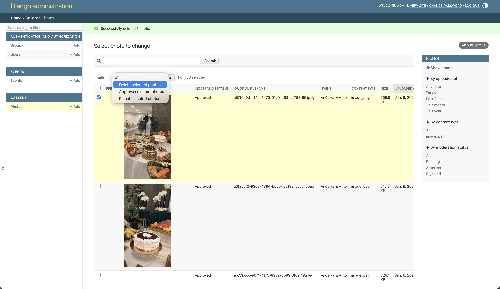
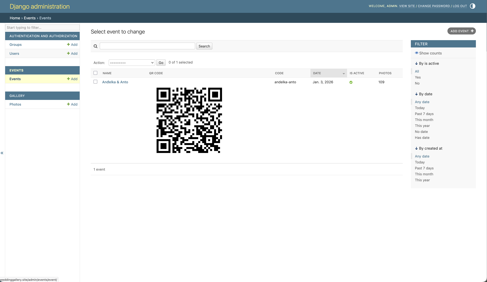
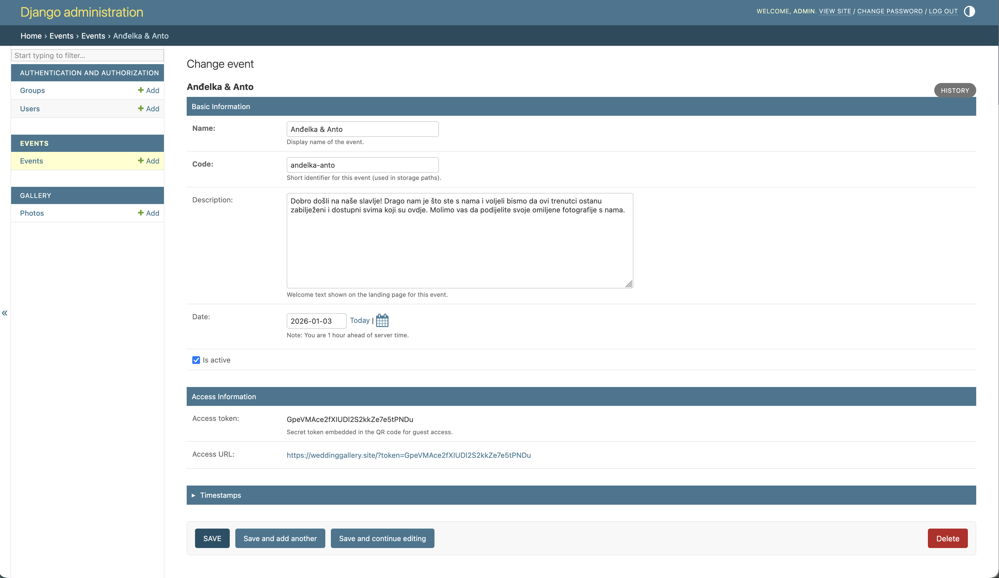

# Wedding Gallery

## Overview

Wedding Gallery is a full-stack web application that enables event guests to upload and browse photos in a shared, private gallery. The project was designed, built, and deployed end-to-end as a hobby project to gain hands-on experience with modern web development and DevOps practices.

The application was successfully used at a real wedding, where guests uploaded and viewed photos throughout the event, validating the system’s reliability and usability in a live, real-world environment.

From a technical perspective, the project demonstrates a complete production workflow: the backend is built with Django and includes an admin interface for photo moderation, while the infrastructure is automated using Terraform (IaC) on AWS. The application is containerized with Docker and deployed via a GitHub Actions CI/CD pipeline, enabling repeatable, automated builds and deployments.

This project showcases practical experience in building, deploying, and operating a real production system from scratch.

## Key Features

-   **Event-Specific Galleries:** Each event gets a unique, private gallery page accessible via a special link.
-   **Simple Photo Uploads:** Guests can easily drag-and-drop or select photos to upload.
-   **Live Gallery:** The gallery updates to show new photos as they are contributed.
-   **Admin Moderation:** A secure backend interface for the event host to manage events and delete photos.

## Technology Stack

This project uses a modern, decoupled architecture.

-   **Frontend:**
    -   **Framework:** React.js

-   **Backend:**
    -   **Framework:** Django & Django REST Framework
    -   **Media Storage:** S3-Compatible Object Storage (MinIO for local, AWS S3 for production)

-   **DevOps & Infrastructure:**
    -   **Containerization:** Docker & Docker Compose
    -   **CI/CD:** GitHub Actions
    -   **Infrastructure as Code (IaC):** Terraform
    -   **Cloud Provider:** Amazon Web Services (AWS)
    -   **Web Server/Proxy:** Nginx

## Screenshots

Here are some example screenshots of the web application:

And example screenshots of admin moderation panel:

## Documentation

For detailed instructions on local setup, deployment, and infrastructure, please refer to the files in the `/docs` directory.