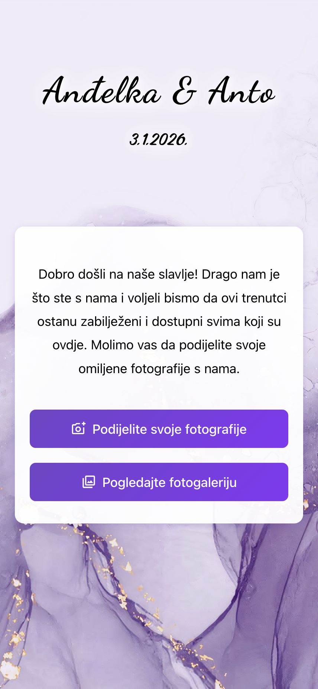
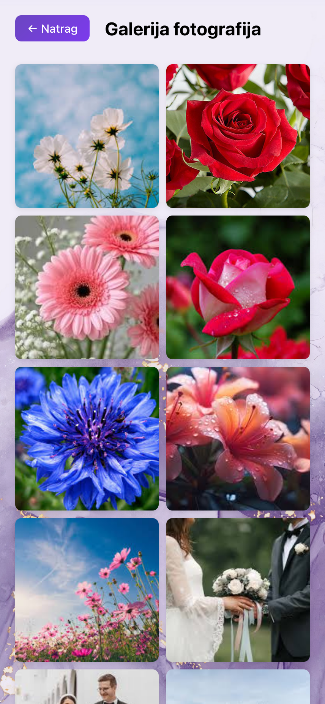
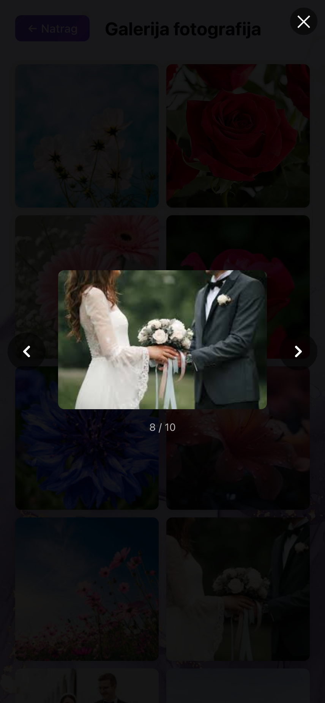

# Wedding Gallery

Wedding Gallery is a simple web application that allows wedding guests to upload and share photos from an event. Guests can scan a QR code at the venue to access the site, upload their pictures, and view the shared gallery of memories in one place.

## Quick Start

See [Local Setup Documentation](docs/LOCAL_SETUP.md) for instructions on running the application locally.

```bash
# Start the application
docker compose up --build

# Run migrations (first time only)
docker compose exec backend python manage.py migrate
```

## Project Structure

- `apps/backend/` - Django REST API backend
- `apps/frontend/` - React frontend application
- `docs/` - Project documentation
- `deploy/` - Deployment configurations
- `infra/` - Infrastructure as Code (Terraform)

## Screenshots

Here are some example screenshots of the web application:





## Documentation

- [Project Overview](docs/PROJECT_OVERVIEW.md) - High-level project plan and architecture
- [Local Setup](docs/LOCAL_SETUP.md) - Local development setup guide 
